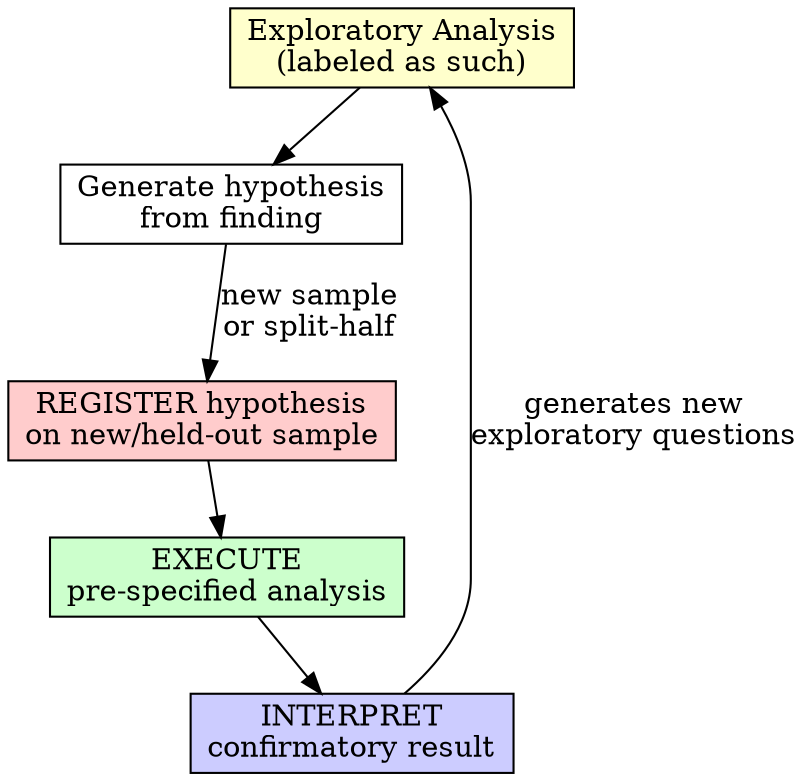

# Hypothesis-First (Scientific TDD)

## Overview

Register the hypothesis first. Run the analysis. Interpret against the prediction.

**Core principle:** If you didn't commit your hypothesis before seeing the data, you don't know if you're doing science or storytelling.

**Violating the letter of the rules is violating the spirit of the rules.**

## When to Use

**Always:**
- Any statistical analysis
- Any model comparison or validation
- Any experiment, pilot, or feasibility study
- Any reanalysis of existing data
- Any "quick look" at results

**Exceptions (discuss with your PI or collaborator):**
- Purely exploratory analyses — permitted, but MUST be labeled as exploratory in all outputs and the manuscript
- Computational benchmarking with no inferential claim

Thinking "skip registration just this once"? Stop. That's rationalization.

## The Iron Law

```
NO DATA ANALYSIS WITHOUT A REGISTERED HYPOTHESIS FIRST
```

Ran the analysis before registering? Delete the results. Start over.

**No exceptions:**
- Don't keep results as "reference"
- Don't "adjust" your hypothesis to match what you found
- Don't peek at effect sizes to calibrate your prediction
- Don't label post-hoc HARKing as "hypothesis-driven"

Register first, then run. Period.

## REGISTER-EXECUTE-INTERPRET

```dot
digraph hypothesis_first_cycle {
    rankdir=LR;
    register [label="REGISTER\nState H1, H0, outcome,\ntest, threshold.\nCommit to VCS.", shape=box, style=filled, fillcolor="#ffcccc"];
    verify_register [label="Verify registration\nis complete", shape=diamond];
    execute [label="EXECUTE\nRun pre-specified\nanalysis exactly.\nNo deviations.", shape=box, style=filled, fillcolor="#ccffcc"];
    verify_execute [label="Any deviation\nfrom plan?", shape=diamond];
    document_deviation [label="Document as\nEXPLORATORY\nlabel deviation", shape=box, style=filled, fillcolor="#ffffcc"];
    interpret [label="INTERPRET\nCompare to prediction.\nReport ALL results.\nNo selective reporting.", shape=box, style=filled, fillcolor="#ccccff"];
    next [label="Next\nhypothesis", shape=ellipse];

    register -> verify_register;
    verify_register -> execute [label="complete"];
    verify_register -> register [label="incomplete:\nfinish it"];
    execute -> verify_execute;
    verify_execute -> document_deviation [label="yes"];
    verify_execute -> interpret [label="no"];
    document_deviation -> interpret;
    interpret -> next;
    next -> register;
}
```



---

### REGISTER — State It Before You Look (RED)

This is the equivalent of writing a failing test. You commit to what you expect before you can possibly know whether you are right.

**A complete registration contains ALL of the following:**

1. **H1 (Alternative Hypothesis):** The specific directional or non-directional claim. Not "Model A differs from Model B" — "Model A outperforms Model B on the held-out test set by at least 0.05 R-squared at 24-month follow-up (one-tailed)."
2. **H0 (Null Hypothesis):** Explicit statement of the no-effect case. Not "no effect" — "Model A R-squared minus Model B R-squared ≤ 0 on the held-out test set at 24 months."
3. **Primary Outcome Measure:** Exactly one. Pre-specified. If you list two, pick one and call the other secondary.
4. **Exact Statistical Test:** Not "appropriate statistics" — "Pearson correlation with one-tailed p-value. If normality violated (Shapiro-Wilk p < 0.05), Spearman rho instead." (See `docs/references/statistical-guide.md` for test selection.)
5. **Significance Threshold:** α = 0.05? α = 0.01? FDR-corrected? State it. Lock it. Include multiple comparison correction method if >1 comparison.
6. **Sample/Inclusion Criteria:** Which subjects, which time points, which exclusion rules — before opening the data file. Include missing value handling policy (listwise / MICE / etc. — see `docs/references/data-checklist.md` §4).
7. **Data Version Lock:** Dataset version tag (e.g., `cohort-v2.4.0-2024-03-15`), file hash(es) (SHA256 of every input file the analysis will read), and preprocessing pipeline version (git commit hash of the preprocessing script). This is the scientific equivalent of a package-lock file — without it, "same analysis" is not reproducible. See `docs/references/data-checklist.md` §7.
8. **Preprocessing Version:** The exact preprocessing pipeline version that produced the analysis-ready data (git tag or commit hash). If the preprocessing is re-run after registration, the registration is invalidated.
9. **Commit hash:** The registration is only valid once it is committed to version control. A file on your laptop is not a registration.

**What "committed to version control" means concretely:**

```bash
# Create the registration file
docs/eureka/registrations/YYYY-MM-DD-<study-id>-registration.md

# Stage and commit BEFORE running any analysis
git add docs/eureka/registrations/YYYY-MM-DD-<study-id>-registration.md
git commit -m "Register hypothesis: <one-line summary>"

# Record the commit hash in your lab notebook or results file
git rev-parse HEAD
```

The timestamp on that commit is your proof. It exists before your results exist. If the commit and the results file share a timestamp, you did not pre-register.

**Verify the registration is complete:**

- H1 stated with specific direction and magnitude estimate
- H0 stated explicitly
- Exactly one primary outcome pre-specified
- Statistical test named by name, not category
- Significance threshold is a number
- Sample and exclusion criteria written down (including missing value policy)
- Data version tag and input file hashes recorded
- Preprocessing pipeline version (git commit or tag) recorded
- Committed to version control with a recorded hash

**Not complete?** Go back. Do not touch the data.

---

### EXECUTE — Run What You Said You Would Run (GREEN)

Run the pre-specified analysis. Exactly.

**Requirements:**
- Use the statistical test you named
- Apply the inclusion criteria you specified
- Do not look at other potential outcomes first
- Do not adjust parameters after seeing partial results
- Fix the random seed at the value recorded in the registration

**If something goes wrong:**

| Situation | Correct Response |
|-----------|-----------------|
| Data quality issue discovered | Stop. Document it. Decide whether to proceed per pre-specified exclusion rules. If not covered, note it as a protocol deviation. |
| Assumption violated (e.g., normality) | Only switch tests if your registration specified a contingency (e.g., "if Shapiro-Wilk p < 0.05, use Spearman"). If not specified, this is a deviation — document and label exploratory. |
| Better analysis idea mid-run | Stop. Do not run it yet. Finish the registered analysis first. Register the new idea as a separate hypothesis. |
| Software error forces a change | Document the error, the forced change, and why it was unavoidable. Label affected results as a protocol deviation. |

**Deviations are allowed. Undisclosed deviations are fraud.**

Every deviation from the pre-specified plan must be:
1. Documented in writing with a reason
2. Labeled as a protocol deviation or exploratory result
3. Separated clearly from the confirmatory pre-registered results in all reports and manuscripts

---

### INTERPRET — Compare to Your Prediction (REFACTOR)

You have results. Compare them to what you said you expected. Report everything.

**Requirements:**
- Report the pre-registered result whether it is significant or not
- Report effect size and confidence interval, not just p-value
- Report the direction of the effect, not just significance
- If you made a prediction about magnitude, compare the observed effect to it
- Exploratory results reported in a separate section, clearly labeled

**Minimum Reporting Standard (every result):**

No statistical claim is complete without ALL of these:
1. Test statistic and **exact** p-value (not "p < 0.05")
2. Effect size with named metric (Cohen's d, r, eta-squared, etc.)
3. 95% confidence interval
4. Multiple comparison correction (if >1 comparison)
5. Sample size per group

```
Template: [Test]: [statistic]([df]) = [value], p = [exact], [effect size] = [value]
(95% CI: [lower, upper]), n = [per group]. [Correction] for [N] comparisons.
```

See `docs/references/statistical-guide.md` for test selection and effect size interpretation.

**What "compare to prediction" means:**

Your registration said: "r > 0.4, one-tailed, α = 0.05."
Your result is: r = 0.31, p = 0.09.

This is a null result. Report it as a null result. Do not:
- Change the threshold
- Switch to two-tailed post-hoc
- Report it as "trending toward significance"
- Report a different outcome measure instead
- Not report it at all

**Null results are results.** A null result from a pre-registered hypothesis is more informative than a significant result from a HARKed one. Null results are publishable. Null results protect the field from wasted replications.

**Selective reporting — reporting only significant results — is p-hacking by omission.** It inflates the published literature's false positive rate just as much as running 20 analyses and reporting the one that worked.

---

## What Registration Is Not

| This is NOT registration | This IS registration |
|--------------------------|----------------------|
| "I have a hypothesis in my head" | Hypothesis written, committed to VCS before analysis |
| "My PI and I discussed it" | Design document written, committed to VCS before analysis |
| "I wrote it in my notebook after seeing the trend" | Commit timestamp predates analysis run timestamp |
| "It was obvious that's what we'd test" | H1, H0, test, threshold explicitly stated in writing |
| "I registered it on OSF after running the analysis" | Registration timestamp demonstrably precedes data access |
| "I'll document the hypothesis in the methods section" | Methods written post-hoc describe what happened, not what was predicted |

---

## Common Rationalizations

| Excuse | Reality |
|--------|---------|
| "My hypothesis is obvious — everyone would predict this" | Unstated hypotheses get adjusted after results. Write it down. |
| "I just want to look at the data first" | Looking at the data before locking the analysis plan is how p-hacking starts. Every time. |
| "I'll register after I confirm the analysis is feasible" | Feasibility checks count as data analysis. Register what you'll check in the feasibility check. |
| "Pre-registration is for clinical trials, not basic research" | HARKing inflates Type I error regardless of research domain. The biology does not care about your field's norms. |
| "We're in exploratory mode — no need to pre-register" | Exploratory work is fine. Label it as exploratory. Do not later present it as confirmatory without a replication. |
| "The analysis plan will change as I understand the data better" | That is post-hoc analysis. You may do it. Label it as post-hoc. Do not present it as hypothesis-driven. |
| "I've run this analysis before — I know what to expect" | Prior experience informs your registered prediction. Write down that prediction. |
| "Pre-registration slows down the research" | Writing the registration takes 30 minutes. Defending a p-hacking accusation in peer review takes months. |
| "The effect is so strong it doesn't need pre-registration" | Strong effects replicate. If your effect is real, it will survive a pre-registered replication. Register it. |
| "I just want to run a quick preliminary analysis" | Preliminary analyses become the paper. The "quick look" becomes Figure 1. Design first. |
| "We can always replicate later to confirm" | Most replication attempts never happen. Your first analysis is likely the record. |
| "Nobody actually pre-registers in this field" | Reproducibility crises happen in fields where nobody pre-registers. You are looking at cause and effect. |

---

## Red Flags — STOP

These situations mean stop and either register properly or explicitly label as exploratory:

- Analysis running before hypothesis committed to VCS
- Hypothesis written after seeing the direction of results
- Statistical test chosen after looking at distributions
- Sample size adjusted after seeing effect size
- Primary outcome switched after analysis
- Significance threshold adjusted post-hoc ("p = 0.06 is marginal")
- Multiple outcomes tested, only significant one reported
- Rationalizing "just this once"
- "I know what the result will be — no need to write it down"
- "It's a different cohort so the prior hypothesis doesn't apply"
- "We can strengthen the registration after we see the data"
- "The reviewers won't know the analysis wasn't pre-registered"

**All of these mean: Delete the analysis results. Restart from REGISTER.**

Kept the unregistered results as "reference"? Delete them. Looked at effect sizes to calibrate your prediction? Your registration is compromised. Start from a new hypothesis on a held-out sample if one exists, or label the entire analysis as exploratory.

---

## Verification Checklist

Before treating any analysis as confirmatory:

- [ ] H1 written with specific direction and magnitude estimate
- [ ] H0 written explicitly (not just "no effect")
- [ ] Exactly one primary outcome pre-specified
- [ ] Statistical test identified by name (not "appropriate test")
- [ ] Significance threshold is a specific number
- [ ] Sample and exclusion criteria documented before data access
- [ ] Missing value handling policy specified before analysis
- [ ] Data version locked (tag or hash) and input file hashes recorded
- [ ] Preprocessing pipeline version (git commit or tag) recorded
- [ ] Registration committed to version control
- [ ] Commit timestamp demonstrably precedes analysis run
- [ ] Analysis ran exactly as specified (or deviations documented)
- [ ] All pre-registered results reported, including nulls
- [ ] Effect size and CI reported, not just p-value
- [ ] Exploratory analyses clearly separated and labeled

Cannot check all boxes? The analysis is exploratory. Label it as such. Do not present it as hypothesis-driven.

---

## The Exploratory Track

Exploratory analysis is not forbidden. It is essential. The rule is not "no exploration" — the rule is "no mislabeling."

**Exploratory analysis is legitimate when:**
- Labeled as exploratory in the analysis file, results file, and manuscript
- Presented as hypothesis-generating, not hypothesis-confirming
- Not used to claim statistical significance (no p-values as evidence of confirmation)
- Followed by a pre-registered replication before confirmatory claims are made

**The exploratory-to-confirmatory pipeline:**



Found something in exploratory analysis and want to claim it as a result? Replicate it in a pre-registered study. No exceptions.

---

## Integration

- **Called by:** `eureka:research-brainstorming` — invoked at the end of the design phase to lock the hypothesis before any analysis begins
- **Reference:** `docs/references/statistical-guide.md` — test selection, effect size interpretation, correction methods
- **Reference:** `docs/references/data-checklist.md` — data version locking, preprocessing requirements, missing value handling
- **Precedes:** All experiment execution and data analysis
- **Applies to:** Every analysis, regardless of perceived simplicity or exploratory intent (exploratory work follows the exploratory track, not a registration-free track)

If `eureka:research-brainstorming` completed a design document, the registration here formalizes it into version control. The design document is the draft; the VCS commit is the registration.

---

## Skill Type

**RIGID** — Follow exactly. Do not adapt away the discipline.

The requirement to commit a hypothesis before running an analysis is not a guideline to balance against convenience. It is the line between confirmatory and exploratory science. Every rationalization that has ever appeared in a retracted paper sounded reasonable at the time. The rule exists precisely because the rationalizations are convincing.

If the rule seems too strict for your situation: label your analysis as exploratory and proceed. That is the correct response. "This is exploratory" is always available. "This is confirmatory but I didn't pre-register" is never available.
