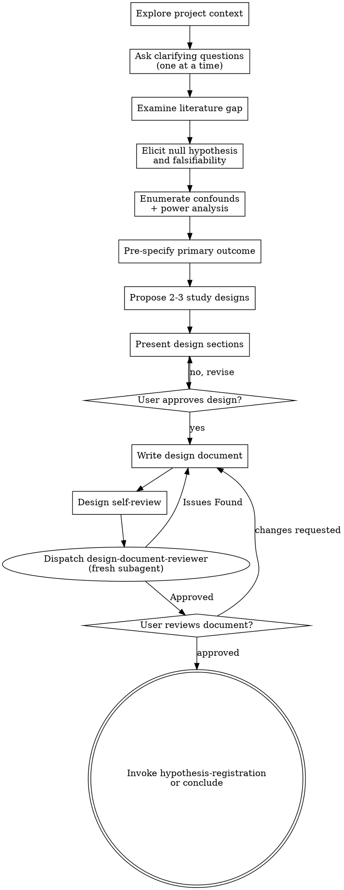

# Brainstorming Research Questions Into Rigorous Designs

Help turn research ideas into fully formed, pre-registered study designs through natural collaborative dialogue.

Start by understanding the current project context, then ask questions one at a time to refine the research question. Once you understand what you're studying, present the design and get user approval.

<HARD-GATE>
Do NOT run any experiment, write any analysis code, collect or process any data, or take any implementation action until you have presented a research design and the user has approved it. This applies to EVERY study regardless of perceived simplicity.
</HARD-GATE>

## Anti-Pattern: "This Is Too Simple To Need A Design"

Every study goes through this process. A correlation check, a single model comparison, a parameter sweep — all of them. "Simple" analyses are where unstated hypotheses and post-hoc rationalization cause the most damage. The design can be short (a few sentences for truly simple studies), but you MUST present it and get approval.

## Checklist

You MUST create a task for each of these items and complete them in order:

1. **Explore project context** — check existing papers, data, prior results, research notes. For data specifically: identify the exact source, version, and preprocessing state available. If the user is unsure which version of the data exists, surface this gap before proceeding.
2. **Ask clarifying questions** — one at a time, understand the research question, constraints, and what success looks like
3. **Examine the literature gap (with Devil's Advocate)** — structured search for what has NOT been done, plus active search for contradictory evidence
4. **Elicit the null hypothesis** — exact statement of H0, not just "no effect"
5. **Test falsifiability** — what specific result would DISPROVE the hypothesis?
6. **Enumerate confounds (including data leakage)** — list the 3 most likely confounding variables AND check for data leakage risks (temporal, subject-level, preprocessing, feature). See `docs/references/data-checklist.md` §3 for the leakage taxonomy.
7. **Assess statistical power** — expected effect size, required sample size, power justification
8. **Pre-specify the primary outcome** — exactly one primary outcome measure, chosen before seeing results
9. **Propose 2-3 study designs** — with trade-offs and your recommendation
10. **Present the research design** — in sections, get approval after each section
11. **Write the research design document** — save to `docs/eureka/designs/YYYY-MM-DD-<topic>-design.md`
12. **Design self-review** — check for placeholders, internal consistency, scope, ambiguity, and verify that null hypothesis and falsifiability criterion both exist
13. **Dispatch `design-document-reviewer` subagent** — fresh-eyes review of the design document against the 11 mandatory questions (9 scientific + 2 narrative framing) and placeholder/consistency checks. Block progression on `Issues Found`; fix and re-dispatch until `Approved`
14. **User reviews written design** — ask user to review before proceeding
15. **Transition** — invoke `eureka:hypothesis-first` to register the hypothesis

## Process Flow

**The terminal state is invoking `eureka:hypothesis-first`.** Do NOT invoke any experiment execution, data analysis, or implementation skill directly from brainstorming.

## The Process

**Understanding the research question:**

- Check the current project state first (existing data, prior results, research notes, literature reviews)
- Before asking detailed questions, assess scope: if the request describes multiple independent studies (e.g., "validate model X on three datasets and compare with four baselines"), flag this immediately. Don't refine details of a study that needs decomposition first.
- If the project is too large for a single design, help the user decompose into sub-studies: what are the independent questions, how do they relate, what order should they be investigated? Then brainstorm the first sub-study through the normal design flow.
- For appropriately-scoped studies, ask questions one at a time to refine the idea
- Prefer multiple choice questions when possible, but open-ended is fine too
- Only one question per message
- Focus on understanding: what is the research question, what data exists, what would a convincing result look like

**Eleven questions that MUST be answered before design approval:**

These do not need to be asked as direct questions — they may emerge naturally from the dialogue. But all eleven must have clear answers in the final design. Questions 1-9 define the science; questions 10-11 define the **narrative frame** so the eventual paper has a story, not just results:

1. **What is the null hypothesis?** (Exact statement, not just "no effect")
2. **What is the primary outcome measure?** (Exactly one, pre-specified)
3. **What would falsify this hypothesis?** (Specific result or threshold)
4. **What are the three most likely confounds, and how will you control for them?**
5. **What is the minimum detectable effect size at 80% power for your sample?**
6. **If the hypothesis is false, what is the most likely true explanation?**
7. **Has anyone published this or something sufficiently similar in the last 3 years?**
8. **What published evidence CONTRADICTS your hypothesis?** (If you can find none, your search is biased — try harder.)
9. **What is the exact data source, version, and preprocessing state you will use?** (Source, version tag or file hash, preprocessing pipeline version, access method. See `docs/references/data-checklist.md` §1.)
10. **At what contribution altitude will this sit?** (Method improvement / new framework / new phenomenon / falsification — see `docs/references/narrative-guide.md` section **"Contribution altitude — 4 tiers"**.) The altitude must match the evidence strength you are planning to collect. Overclaiming altitude → desk rejection; underclaiming → sold short.
11. **What is the one-sentence story arc?** (Problem-driven / opportunity-driven / surprise-driven / falsification-driven — see `docs/references/narrative-guide.md` section **"Story arc patterns — 4 shapes"**.) State the headline **both** for the predicted outcome AND for the opposite outcome. If the opposite outcome would leave you with no honest story, the study may not be worth running — or the design needs reframing.

## Examining the Literature Gap (Step 3 Detail)

Step 3 is not a casual review. It requires structured search and a Devil's Advocate check. Your memory of "relevant papers" is biased toward papers that support your hypothesis.

**Structured search:**
- Define search terms BEFORE searching — do not revise them based on results
- Search multiple sources (PubMed, Scopus, Google Scholar, preprint servers, domain-specific repos)
- Forward citation chasing: who cited the key papers?
- Backward citation chasing: what did key papers cite?
- Check adjacent fields with different terminology

**Evidence-based gaps only:**
- Valid: "No study has applied [method X] to [population Y]. The closest is [Citation], which used [related method] but excluded [criterion]."
- Invalid: "This area is understudied." (assertion without evidence)
- Every gap claim must cite at least one paper that approaches but does not fill it.

**Devil's Advocate (mandatory, not optional):**

After identifying the gap, actively search for papers that CONTRADICT your hypothesis or show that a similar approach failed.

- Search with negative-outcome terms: "[your method] fails", "[your approach] limitations", "[your target] null result"
- Check preprint servers — null results are more likely to appear as preprints
- Look for meta-analyses reporting heterogeneous or null findings

**If you find zero contradictory papers:** Default assumption is your search is biased. Try different terms, different databases, different fields. Only after exhausting these can you conclude the field is unanimously supportive.

Document contradictions honestly in the design document. If you cannot explain a contradiction, note the unresolved tension — do not pretend it doesn't exist.

**Exploring study designs:**

- Propose 2-3 different designs with trade-offs
- Present options conversationally with your recommendation and reasoning
- Lead with your recommended option and explain why
- Consider: internal validity vs. external validity, feasibility vs. rigor, existing data vs. new collection

**Presenting the design:**

- Once you believe you understand the study, present the design
- Scale each section to its complexity: a few sentences if straightforward, more if nuanced
- Ask after each section whether it looks right so far
- Cover: research question, hypotheses, variables, study design, analysis plan, expected results, limitations
- Be ready to go back and clarify if something doesn't make sense

**Working in existing research projects:**

- Explore the current project structure before proposing a new study. Follow existing conventions for data organization, naming, and analysis patterns.
- Where existing work has issues that affect the new study (e.g., a confound in a prior analysis, an underpowered sample), address those as part of the design — the way a thorough researcher improves work they're building on.
- Don't propose unrelated methodological changes. Stay focused on what serves the current research question.

## After the Design

**Documentation:**

- Write the validated design to `docs/eureka/designs/YYYY-MM-DD-<topic>-design.md`
  - (User preferences for save location override this default)
- Use the research design document template at `docs/templates/research-design-doc.md` as the structure

**Design Self-Review:**

After writing the design document, review it with fresh eyes:

1. **Placeholder scan:** Any "TBD", "TODO", incomplete sections, or vague requirements? Fix them.
2. **Internal consistency:** Do the hypotheses match the analysis plan? Does the study design actually test what you claim?
3. **Scope check:** Is this focused enough for a single study, or does it need decomposition?
4. **Ambiguity check:** Could any part of the analysis plan be interpreted two different ways? If so, pick one and make it explicit.
5. **Null hypothesis check:** Is H0 stated explicitly and precisely?
6. **Falsifiability check:** Is there a specific result that would disprove H1?

Fix any issues inline. No need to re-review — just fix and move on.

**Dispatching the Design Document Reviewer:**

After the inline self-review is clean, dispatch a fresh subagent reviewer to catch blind spots that the main agent's self-review misses. Inline self-review is the writer checking their own work in the same session — a fresh subagent brings fresh eyes.

1. Locate the reviewer prompt at `skills/research-brainstorming/design-document-reviewer-prompt.md`
2. Fill the `{DESIGN_DOC_PATH}` placeholder with the path to the design document you just wrote
3. Dispatch via the Task tool (`general-purpose` subagent) with the filled prompt
4. Wait for the reviewer to return with `Status: Approved` or `Status: Issues Found`

**Acting on the reviewer's response:**

- **`Status: Approved`** → proceed to the User Review Gate below
- **`Status: Issues Found`** → fix each issue in the design document. Then re-dispatch the reviewer to verify the fixes. Repeat until `Approved`. Do NOT present the document to the user until the reviewer approves — the user should see a document that has already passed independent review.

If the reviewer finds the same issue on a second dispatch after an attempted fix, escalate to the user: describe the issue, the fix attempted, and ask for guidance.

**User Review Gate:**

After the self-review passes, ask the user to review the written design before proceeding:

> "Research design written to `<path>`. Please review it and let me know if you want to make any changes before we proceed to hypothesis registration."

Wait for the user's response. If they request changes, make them and re-run the self-review. Only proceed once the user approves.

**Next step:**

- Invoke `eureka:hypothesis-first` to formally register the hypothesis, lock the analysis plan, and commit to version control before any analysis begins.

## Key Principles

- **One question at a time** — Don't overwhelm with multiple questions
- **Multiple choice preferred** — Easier to answer than open-ended when possible
- **Null hypothesis is non-negotiable** — Every study has one, stated explicitly
- **Pre-specify ruthlessly** — Primary outcome, statistical test, significance threshold — all before seeing results
- **Explore alternatives** — Always propose 2-3 designs before settling
- **Incremental validation** — Present design, get approval before moving on
- **Be flexible on methods, rigid on rigor** — The study design can adapt; the requirement for falsifiability cannot

## Common Anti-Patterns

| What the researcher says | What's actually happening | What to do |
|--------------------------|--------------------------|------------|
| "The hypothesis will emerge from the data" | HARKing (Hypothesizing After Results are Known) | State the hypothesis before any analysis. Exploratory work is fine — but label it as exploratory, not confirmatory. |
| "We'll figure out the statistics after we see the results" | p-hacking risk | Lock the statistical test, correction method, and significance threshold before running the analysis. |
| "The design is basically the same as [Paper X]" | Implicit assumptions, unexamined differences | Describe the design completely. What seems "the same" often differs in sample, measures, or context. |
| "Let me just run a pilot first" | A pilot IS an experiment | Design the pilot too. Define what you'll learn from it, what threshold leads to proceeding, and what stops the project. |
| "I already know what the answer will be" | Confirmation bias | State what you'd expect if the hypothesis is WRONG. If you can't, the hypothesis isn't falsifiable. |
| "The effect is obvious — we don't need a power analysis" | Overconfidence in effect size | Run the power analysis anyway. "Obvious" effects often shrink on replication. |
| "I can't state an opposite-outcome headline (Q11) — it's an exploratory observational study" | Q11 may still have an honest answer even for exploratory work | For exploratory or first-of-kind studies, the opposite outcome may be "we observed no systematic pattern / no coherent story emerged". If that is the honest alternative AND the study is worth running anyway (e.g., because even a null pattern is a field-informative result), frame the arc as **opportunity-driven** or **falsification-driven** rather than problem-driven. If the opposite outcome is truly that the study yields no reportable finding, flag this as a design concern — the study may not be worth the effort. |

## Integration

- **Called by:** `eureka:using-eureka` (when research question is detected)
- **Invokes:** `eureka:hypothesis-first` (after design approval)
- **Does NOT invoke:** Any experiment execution, data analysis, or implementation skill
- **Reference:** `docs/references/data-checklist.md` — data provenance, preprocessing, leakage taxonomy, missing value handling
- **Reference:** `docs/references/narrative-guide.md` — sections **"Contribution altitude — 4 tiers"** and **"Story arc patterns — 4 shapes"** for questions 10-11
