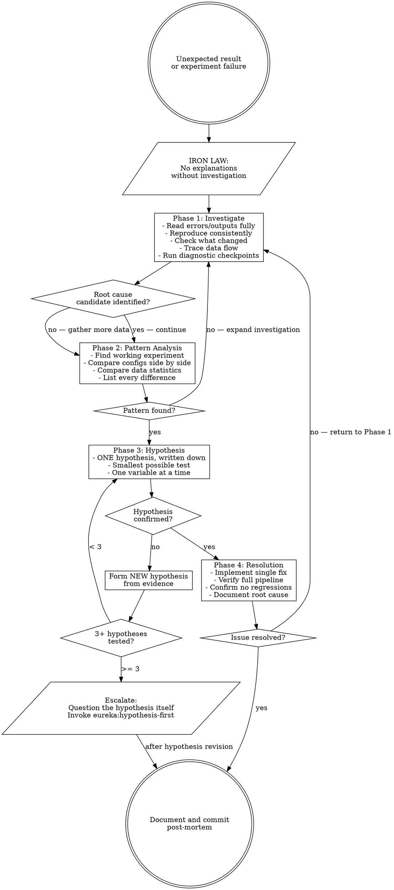

# Systematic Troubleshooting

## Overview

Guessing at explanations wastes time and corrupts the scientific record. Post-hoc rationalization is indistinguishable from cargo-cult science.

**Core principle:** ALWAYS investigate root cause before proposing explanations or re-running experiments. Rationalization without investigation is failure.

**Violating the letter of this process is violating the spirit of scientific rigor.**

## The Iron Law

```
NO EXPLANATIONS WITHOUT ROOT CAUSE INVESTIGATION FIRST
```

If you haven't completed Phase 1, you cannot propose why an experiment failed.

## When to Use

Use for ANY unexpected experimental result:
- Model performance far below or above expectation
- Analysis output that contradicts prior findings
- Metric values that don't make domain sense (e.g., correlation > 1, negative variance)
- Convergence failures, NaN/Inf in outputs
- Results that change between runs with no code change
- Findings that contradict established literature

**Use this ESPECIALLY when:**
- Under deadline pressure (temptation to re-run and hope is highest)
- "I know what went wrong" feels obvious
- You've already tried re-running multiple times
- A reviewer asked why results differ from a prior submission
- You don't fully understand the pipeline end to end

**Don't skip when:**
- The issue seems minor (small discrepancies have real causes)
- You're in a hurry (systematic is faster than rationalized thrashing)
- The paper deadline is close (wrong results submitted is worse than delayed submission)

## The Four Phases

You MUST complete each phase before proceeding to the next.

### Phase 1: Investigate

**BEFORE proposing any explanation or re-running:**

1. **Read Error Messages and Output Carefully**
   - Don't skip past warnings — in scientific pipelines, warnings are often the finding
   - Read log files completely, not just the final summary line
   - Note exact metric values, not approximations
   - Record environment: library versions, hardware, OS, date

2. **Reproduce the Issue Consistently**
   - Can you trigger the unexpected result reliably?
   - Does it occur with a fixed random seed?
   - Does it occur across multiple runs?
   - If not reproducible → gather more data before any diagnosis

3. **Check What Changed**
   - What is different from the last known-good run?
   - Data version (new cohort, updated preprocessing, different split)
   - Code version (recent commits, dependency updates)
   - Config changes (hyperparameters, thresholds, paths)
   - Environment (new Python package versions, different compute node)
   - Random seed (was seed fixed? is it used consistently throughout the pipeline?)

4. **Trace Data Flow from Input to Output**

   **For multi-stage pipelines (raw data → preprocessing → model → analysis → unexpected output):**

   Add diagnostic checkpoints BEFORE proposing explanations:
   ```
   For EACH pipeline stage boundary:
     - Log input shape, dtype, summary statistics (N, mean, std, NaN count)
     - Log output shape, dtype, summary statistics
     - Verify expected invariants hold (e.g., no data leakage, correct normalization)
     - Check that config values are actually applied, not silently overridden

   Run once to gather evidence of WHERE the problem occurs
   THEN analyze to identify the failing stage
   THEN investigate that specific stage
   ```

   **Example (neuroimaging pipeline):**
   ```python
   # Stage 1: Raw data loading
   print(f"Raw subjects loaded: {len(subjects)}, missing: {df.isnull().sum().sum()}")

   # Stage 2: Preprocessing
   print(f"After preprocessing: shape={X.shape}, NaN={np.isnan(X).sum()}, range=[{X.min():.3f}, {X.max():.3f}]")

   # Stage 3: Train/test split
   print(f"Train N={len(X_train)}, Test N={len(X_test)}, seed={config.seed}")
   print(f"Train label distribution: {Counter(y_train)}")
   print(f"Test label distribution: {Counter(y_test)}")

   # Stage 4: Model output
   print(f"Predictions: mean={preds.mean():.3f}, std={preds.std():.3f}, range=[{preds.min():.3f}, {preds.max():.3f}]")
   ```

   **This reveals:** Which stage produces invalid values (e.g., normalization ✓, split ✗ due to data leakage)

5. **Research-Specific Diagnostic Checks**

   | Check | What to Look For |
   |-------|-----------------|
   | **Data quality** | Missing values, outliers beyond domain range, distribution shift between splits, duplicate subjects |
   | **Preprocessing consistency** | Same pipeline applied to train and test? Any step fitted on full data before split? |
   | **Data leakage** | Test-set labels or future timepoints visible during training? Subject-level vs. scan-level split? See `docs/references/data-checklist.md` §3 for full taxonomy (temporal, group, feature, preprocessing, label, duplication, target encoding, hyperparameter). |
   | **Numerical issues** | NaN/Inf propagation, overflow in softmax/log, near-zero denominators, ill-conditioned matrices |
   | **Random seed fixation** | Seed set before data split, model init, and augmentation? Library-specific seeds (numpy, torch, random) all set? |
   | **Config propagation** | Is the config you loaded the one actually used? Are any values silently defaulting? |
   | **Metric calculation** | Correct averaging (macro/micro/weighted)? Correct class assignment? Correct sign convention? |
   | **Baseline reference** | Are you comparing to the correct baseline run, not a cached or stale result? |

### Phase 2: Pattern Analysis

**Find the pattern before forming explanations:**

1. **Find Working Experiments for Comparison**
   - Locate a prior run that produced the expected result
   - Identify the last known-good commit and config
   - Run the known-good config on current data — does it still work?

2. **Compare Configs Side by Side**
   - Diff the failing config against the working config
   - Every field, not just the ones you changed
   - Environment files and dependency versions count

3. **Compare Data Statistics**
   - N per group, mean, std, min, max, NaN rate
   - Distribution shape — did the cohort composition change?
   - Label balance — is the class distribution the same?

4. **List Every Difference**
   - Between working and failing: write them all down
   - Don't assume "that can't matter"
   - A change in normalization order, cohort filter, or random seed can fully explain surprising results

5. **Don't Assume — Verify**
   - "I think the data is fine" is not verified
   - Print summary statistics. Check them. Then conclude they are fine.

### Phase 3: Hypothesis and Testing

**Scientific method applied to your own pipeline:**

1. **Form ONE Hypothesis**
   - State clearly: "I think X caused the unexpected result because Y"
   - Write it down before testing
   - Be specific: name the stage, variable, or operation suspected
   - Example: "I think test performance is inflated because the normalization scaler was fit on the full dataset before the train/test split, causing leakage"

2. **Test with the Smallest Possible Change**
   - Isolate the suspected variable only
   - One change per test
   - If possible, construct a minimal reproduction (small synthetic dataset where the bug is obvious)

3. **One Variable at a Time**
   - Do NOT fix multiple suspected issues in a single run
   - You will not be able to determine which fix (if any) resolved the issue

4. **Evaluate Result**
   - Did the change resolve the unexpected result? → Phase 4
   - Did it not? → Form a NEW hypothesis from the evidence gathered
   - DO NOT stack fixes on top of a failed hypothesis

5. **When You Don't Know**
   - Say "I don't understand why stage X produces this output"
   - Don't rationalize — trace further
   - Bring in domain knowledge only after you've exhausted empirical investigation

### Phase 4: Resolution

**Fix the root cause, not the symptom:**

1. **Verify the Fix Completely**
   - Re-run full pipeline with the fix in place
   - Confirm the unexpected result is gone
   - Confirm no other metrics or outputs changed unexpectedly
   - Confirm on held-out data if applicable

2. **Implement Single Fix**
   - Address only the root cause identified
   - No "while I'm here" methodology changes
   - No bundled improvements — those are separate experiments

3. **Document What Went Wrong and Why**
   - Write a brief post-mortem: what was the root cause, how was it found, what was changed
   - Commit the fix with a message that describes the root cause, not just the symptom
   - Update any affected configs, READMEs, or analysis logs

4. **If Fix Doesn't Work**
   - STOP
   - Count: How many explanations have you tested?
   - If < 3: Return to Phase 1 with the new evidence
   - **If ≥ 3: STOP and question the hypothesis itself (step 5 below)**
   - Do NOT attempt a fourth fix without stepping back

5. **If 3+ Fixes Failed: Question the Hypothesis Itself**

   **Pattern indicating a wrong hypothesis about the data or model:**
   - Each fix resolves one issue but exposes a new unexpected result elsewhere
   - Fixes require restructuring the entire pipeline to implement
   - The "unexpected result" keeps shifting form rather than disappearing

   **STOP and question fundamentals:**
   - Is the underlying scientific hypothesis sound?
   - Is the expected result actually what the model should produce?
   - Is the evaluation metric appropriate for the task?
   - Is the comparison baseline actually comparable?
   - Are we "fixing the pipeline" when the finding itself is the signal?

   **Invoke `eureka:hypothesis-first` and re-examine the original research hypothesis before continuing.**

   This is not a failed debugging session — this may be a wrong assumption about what the result should be.

## Flowchart



## Red Flags — STOP and Follow Process

If you catch yourself thinking any of the following, STOP and return to Phase 1:

- "It's probably a numerical issue, let me add a small epsilon"
- "The data is probably fine — let me just re-run with a different seed"
- "I'll explain the discrepancy in the Discussion section"
- "These results are close enough to expected"
- "Multiple things might be wrong — let me fix them all and re-run"
- "I ran it twice and got different results, so I'll report the better one"
- "The model probably just needs more epochs"
- "This is likely due to dataset characteristics" (without actually checking)
- "One more re-run" (when already tried 2+)
- "The reviewer probably won't notice"
- Proposing biological or methodological explanations before checking data quality

**ALL of these mean: STOP. Return to Phase 1.**

**If 3+ hypotheses failed:** The hypothesis itself may be wrong. Invoke `eureka:hypothesis-first`.

## Common Rationalizations

| Excuse | Reality |
|--------|---------|
| "The model is just sensitive to initialization" | Random seed instability has a root cause. Fix the seed, then investigate. |
| "Results differ because of data heterogeneity" | Possibly true — but verify it with statistics before claiming it. |
| "The baseline probably wasn't tuned well" | If you can't reproduce the baseline exactly, you can't compare against it. |
| "This is expected given the small sample size" | Expected = predicted by power analysis. If you didn't run one, you don't know. |
| "NaN values are from outlier subjects — we can drop them" | NaNs appearing mid-pipeline indicate a bug. Find it before dropping anything. |
| "The literature reports similar variance" | The literature reporting it doesn't make your pipeline correct. |
| "Re-running fixed it — must have been a transient issue" | Transient results are unreproducible results. Investigate before publishing. |
| "The effect disappeared after preprocessing differently" | That is a finding, not a fix. Investigate which preprocessing is scientifically correct. |
| "Our method is novel so comparison is hard" | Novelty doesn't exempt you from sanity checks and ablations. |
| "The p-value is borderline but the trend is clear" | Borderline p-values require power analysis and effect size reporting, not narrative. |
| "Emergency, no time for root cause analysis" | Systematic troubleshooting is faster than re-running blind. Always. |
| "I've already tried 3 things — one more attempt" | Three failures signal a wrong hypothesis. Escalate, don't iterate. |

## If 3+ Fixes Failed: Escalate

**Stop attempting fixes. Invoke `eureka:hypothesis-first`.**

Three failed hypotheses are a signal, not bad luck. Ask:

1. **Is the result actually unexpected?** — Re-examine your prior expectations against the literature
2. **Is the evaluation metric correct?** — Does this metric measure what you intend to measure?
3. **Is the comparison fair?** — Are preprocessing, splits, and baselines actually matched?
4. **Is the finding the signal?** — Could the "unexpected" result be a valid scientific finding rather than a bug?
5. **Is the original hypothesis falsified?** — If so, acknowledge it and pivot

Document all three failed hypotheses before escalating. They are evidence.

## Quick Reference

| Phase | Key Activities | Gate to Next Phase |
|-------|---------------|-------------------|
| **1. Investigate** | Read outputs fully; reproduce consistently; check what changed; trace data flow with diagnostic checkpoints; research-specific checks | Candidate location of failure identified |
| **2. Pattern Analysis** | Find working experiment; diff configs; compare data statistics; list every difference | Pattern distinguishing working from failing identified |
| **3. Hypothesis and Testing** | State one specific hypothesis; test with smallest change; one variable at a time | Hypothesis confirmed OR new evidence gathered |
| **4. Resolution** | Implement single fix; verify full pipeline; confirm no regressions; document root cause | Issue resolved and documented |

## Integration

- **Triggered by:** Unexpected experimental result, failed analysis, contradictory finding
- **Pairs with:** `eureka:hypothesis-first` — if 3+ fixes fail, re-examine the original hypothesis before continuing
- **Reference:** `docs/references/statistical-guide.md` — after root cause is found, verify the corrected analysis meets statistical reporting standards
- **Reference:** `docs/references/data-checklist.md` — data leakage taxonomy, preprocessing pipeline checks, split strategy best practices
- **Pairs with:** `eureka:verification-before-publication` — before claiming a resolved issue is ready for publication
- **Does NOT replace:** `eureka:research-brainstorming` — if investigation reveals the entire study design needs revision, use that skill

## Skill Type

**RIGID** — The four-phase sequence is not optional. Phase ordering is enforced. The Iron Law is not a suggestion.

The only flexibility is in the diagnostic methods within each phase — adapt them to your domain and pipeline. The phases themselves do not flex.
