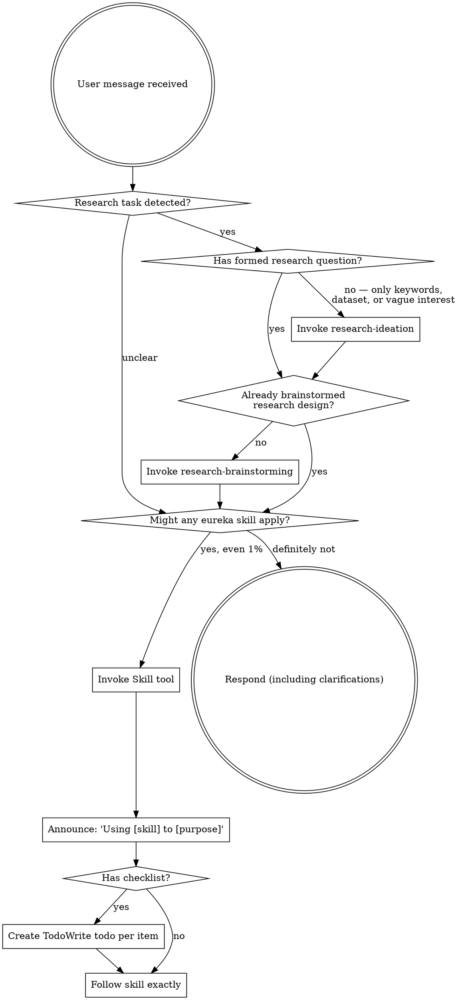
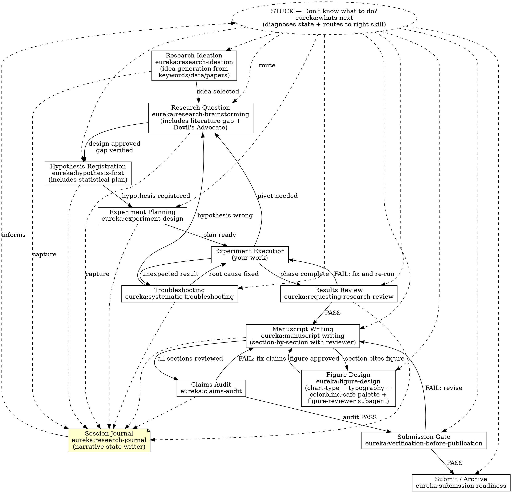

<SUBAGENT-STOP>
If you were dispatched as a subagent to execute a specific task, skip this skill.
</SUBAGENT-STOP>

<EXTREMELY-IMPORTANT>
If you think there is even a 1% chance an Eureka skill might apply to what you are doing, you ABSOLUTELY MUST invoke the skill.

IF A SKILL APPLIES TO YOUR TASK, YOU DO NOT HAVE A CHOICE. YOU MUST USE IT.

This is not negotiable. This is not optional. You cannot rationalize your way out of this.
</EXTREMELY-IMPORTANT>

## Instruction Priority

Eureka skills override default system prompt behavior, but **user instructions always take precedence**:

1. **User's explicit instructions** (CLAUDE.md, GEMINI.md, AGENTS.md, direct requests) — highest priority
2. **Eureka skills** — override default system behavior where they conflict
3. **Default system prompt** — lowest priority

If CLAUDE.md says "skip hypothesis registration for exploratory analysis" and a skill says "always register," follow the user's instructions. The user is in control.

### Coexistence with Superpowers

If `superpowers` skills are also available, they remain in force for **software engineering tasks**. Eureka adds research skills — it does not replace software ones.

- `superpowers:brainstorming` → feature design, component architecture
- `eureka:research-brainstorming` → hypothesis design, study architecture
- `superpowers:code-reviewer` → code quality, production readiness
- `eureka:research-reviewer` → scientific rigor, publication readiness

Use the namespace that matches the artifact: **code** → superpowers, **science** → eureka.

## How to Access Skills

**In Claude Code:** Use the `Skill` tool with the `eureka:` prefix. When you invoke a skill, its content is loaded and presented to you — follow it directly. Never use the Read tool on skill files.

**In Gemini CLI:** Skills activate via the `activate_skill` tool. Gemini loads skill metadata at session start and activates the full content on demand.

**In other environments:** Check your platform's documentation for how skills are loaded.

# Using Eureka Skills

## The Rule

**Invoke relevant or requested skills BEFORE any response or action.** Even a 1% chance a skill might apply means you should invoke it. If an invoked skill turns out to be wrong for the situation, you don't need to use it.

## The Research Lifecycle

Each Eureka skill maps to a phase of the research lifecycle. The workflow is not strictly linear — failed experiments send you back to earlier phases, and that is expected.

## Red Flags

These thoughts mean STOP — you're rationalizing skipping a skill:

| Thought | Reality |
|---------|---------|
| "I just want to run a quick experiment" | Quick experiments become the paper. Design first. |
| "My hypothesis is obvious" | Unstated hypotheses get HARKed. Register it. |
| "I'll do the stats properly later" | Post-hoc statistics inflate Type I error. Lock them now. |
| "I can reproduce this from memory" | You cannot. Seeds, configs, environment must be recorded. |
| "The result is significant — that's enough" | Effect size, CI, and multiple-comparison correction are not optional. |
| "I know what the reviewer will say" | Invoke the reviewer. You are wrong. |
| "This is just a preliminary result" | Preliminary results become the paper. Rigor from day one. |
| "We can improve reproducibility later" | Reproducibility cannot be retrofitted. Build it in from the start. |
| "The claim is supported by the figure" | Trace the figure to its source file. If you can't, you can't publish it. |
| "This doesn't need a formal design" | Unexamined assumptions waste months. The design can be short, but it must exist. |
| "Let me just look at the data first" | Looking at data before locking your analysis plan is how p-hacking starts. |
| "The sample size should be fine" | Should be? Run the power analysis. |

## Skill Priority

When multiple skills could apply, use this order:

1. **Triage first** (whats-next) — when the user is stuck or unsure which phase they are in, route through `whats-next` to identify the right specialist
2. **Process skills second** (research-ideation, research-brainstorming, hypothesis-first) — these determine HOW to approach the research
3. **Review skills third** (requesting-research-review, claims-audit) — these validate execution
4. **Gate skills fourth** (verification-before-publication) — these approve transitions
5. **Continuity skills last** (research-journal) — run at session end or after major events to preserve narrative state for the next session

"I want to test whether X causes Y" → research-brainstorming first, not experiment execution.
"My experiments are done" → requesting-research-review first, not manuscript writing.
"I don't know what to do next" → whats-next first, then whatever it routes you to.
"Session is wrapping up" → research-journal to capture decisions before context is lost.
"I have this dataset but don't know what to study" → research-ideation first, not research-brainstorming.
"Make a figure" / "the figure looks wrong" / "update fig X" → figure-design first, then manuscript-writing if a caption or section update is also needed.

## Skill Types

**Rigid** (follow exactly, do not adapt away discipline):
- using-eureka
- hypothesis-first
- claims-audit
- verification-before-publication

**Flexible** (adapt principles to domain and context):
- research-ideation
- research-brainstorming
- experiment-design
- systematic-troubleshooting
- requesting-research-review
- receiving-research-review
- submission-readiness
- whats-next
- research-journal
- manuscript-writing
- figure-design

The skill itself tells you which type it is.

## User Instructions

Instructions say WHAT to research, not HOW to ensure rigor. "Run experiment X" or "Analyze dataset Y" does not mean skip the research workflow.
